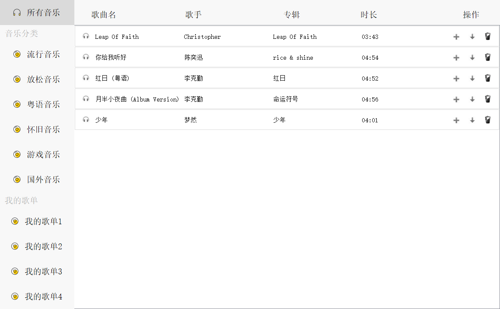
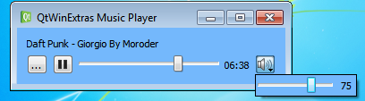
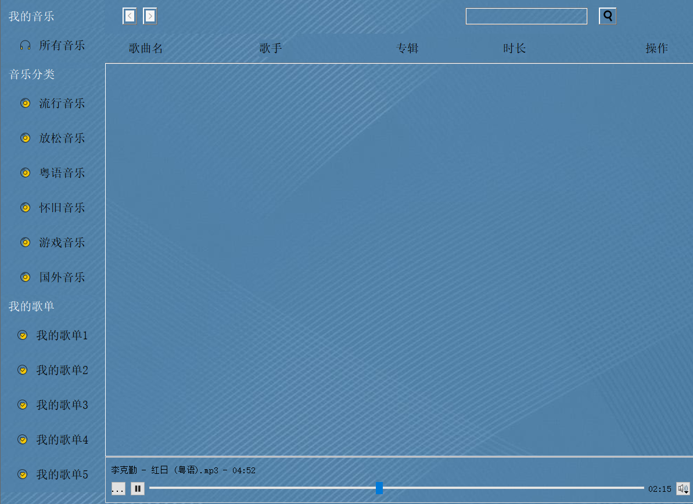

# Qt-MusicPlayer
## 1.  项目介绍

该项目是一款基于Qt应用程序开发框架用c++语言编写的音乐播放器，该播放器集合了对音乐的播放，暂停，拖动快进，音量控制，本地音乐的导入（包含拖拽导入），歌单分类，界面皮肤设置，对导入的音乐进行指定播放，删除等功能。

## 2.  项目界面展示

### 2.1 普通界面

### 2.2 音乐界面

### 2.3 歌单界面

### 2.4 皮肤界面

## 3.项目重点功能代码

### 3.1 UI界面设计

代码：（ui界面以图形设计为主，转换成的代码量有上前行，故此处只展示实现的图形设计页面及主要控件）

主要控件：

QPushbutton按钮（用来实现各个页面目录切换及特定功能交互），QgroupBox(用来放置按钮等控件，使得它们能整合成一个整体)

QStackedWidget(用来实现目录下各页面的切换)

Qmenu(菜单栏) QlineEdit(搜索栏)

QListWidget（歌曲列表） Qwidget（放置按钮及进度条）

### 3.2 歌单页面切换功能

代码：

成果：

### 3.3 歌单导入、播放、删除功能代码

代码：

成果：

### 3.4 播放器代码（包含播放暂停、读入文件、进度条、音量等）

代码：（由于代码量的原因，只展示声明部分）

说明：该部分代码采用了Qt的QmediaPlayer类来定义播放器类，借鉴了Qt现有的示例代码，考虑到ui界面兼容性的问题，删去了部分功能（包括播放器缩略图，任务栏进度，缩略图的播放按钮等）

代码成果：

### 3.5 界面皮肤更换功能代码 

代码：

成果：

## 4.  项目设计

### 4.1  平台及语言选择

考虑到现有所学知识及该项目适用的平台框架选择了用c++加Qt框架来实现对项目的开发。

### 4.2  初步框架构想

参考了两个现成的音乐播放器：

Listen1(由个人开发者编写而成):

QQ音乐（由腾讯公司开发而成）：

根据这两个音乐播放器，我观察到了几个共同点：

1. 目录菜单位置相同

2. 目录下页面位置相同

3. 播放按钮控制及进度条歌曲信息位置都放在软件下方（稍显不同的是Listen1覆盖了菜单而QQ音乐没有）

也观察到了不同点：

1. Listen1没有导入本地音乐功能，只能爬取各大音乐网站资源，并且不提供下载。而QQ音乐可以导入本地，也提供下载。

2. Listen1简洁，而QQ音乐功能虽多，但反倒显得太杂，给人一种花里胡哨的感觉。

结合以上异同及所学知识的把握，我脑海中已经有了对框架的初步构思：

1. 目录放到左侧进行对音乐分块，音乐列表放在右侧与目录对应，便于用户根据自身需求选择部分音乐播放。

2. 添加菜单栏功能，实现播放音乐，导入音乐，导入音乐到特定歌单，切换皮肤等功能。

3. 播放按钮及进度条音量控制等放在音乐列表下方，能直观的展示出正在播放的音乐，并且加入两个特色功能：一是可对该播放模块进行拖拽移动；二是可以直接将要播放的音乐拖拽进模块直接播放，省去了用菜单栏导入的过程。

### 4.3  设计难题

#### 4.3.1  目录页面切换

当涉及到页面间的切换时，脑海中不由自主的想到了学过的qt控件中有一个QstackWidget可以容纳多个页面，并且可以通过按钮进行切换。于是，设计了通过利用该控件与按钮相结合，对按钮增加点击变色的属性，并加以排版和去除边框，成功的实现了目录及目录页面切换的功能。

#### 4.3.2   歌单列表制作

因为是列表构造，所以难免会用到QListWidget插件，但是由于播放列表不仅仅要展现歌曲的名字，还要有各种按钮对歌曲进行相关操作。于是通过查阅帮助文档及各种资料，发现QgroupBox和QHBoxLayout组合可以添加各种标签和按钮并有序排列，再利用QlistWidgetItem添加进QlistWidget中，成功实现歌曲列表的制作。

#### 4.2.3   播放模块的添加

考虑到时间及现有知识的局限，在Qt的示例中找到了实现播放器模块的一个简单实例：

通过对该示例的研究，将其整合到了自身项目当中，考虑到与项目的兼容性问题，删减了该示例中部分功能（包括缩略图播放，菜单栏歌曲进度条等）。其中，要想将两个窗口合并，需要将播放模块作为主窗口的成员，并设定其为主窗口的派生类，才能达到合并的效果。

#### 4.3.4   歌单歌曲播放和删除

通过在播放模板类中定义QList<QUrl>成员来保存歌曲的地址，之后在导入歌单的过程中，将歌单中的播放按钮与QList<QUrl>成员通过信号与槽链接，实现每首歌曲的播放按钮播放的是该歌曲功能。并且在导入歌单的过程中，将歌单中的删除按钮与removeItemWidget函数和delete函数通过信号和槽连接，实现歌曲删除功能。